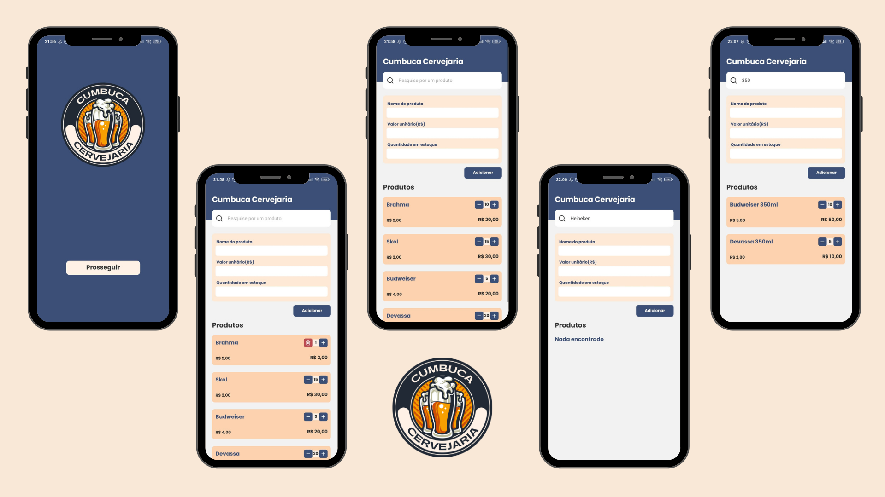

<div align="center"></div>

# Cumbuca Cervejaria 🍻
#### Projeto de armazenamento de produtos 🚀



### 🧪 Tecnologias Utilizadas
- React Native
- Typescript
- Styled-component
- Async Storage
- Formik
- Yup
 
## 🚀 Como usar

#### clonar o repositório
```bash
git clone https://github.com/Gabriela-Leite/cervejariaCumbuca.git
```

#### instalar as dependências
```bash
npm install
```

#### rodando o projeto
```bash
npx react-native start --reset-cache
```
e
```bash
npx react-native run-android
```


##### Opa, bom dia ☀️ por Gabriela Miranda
